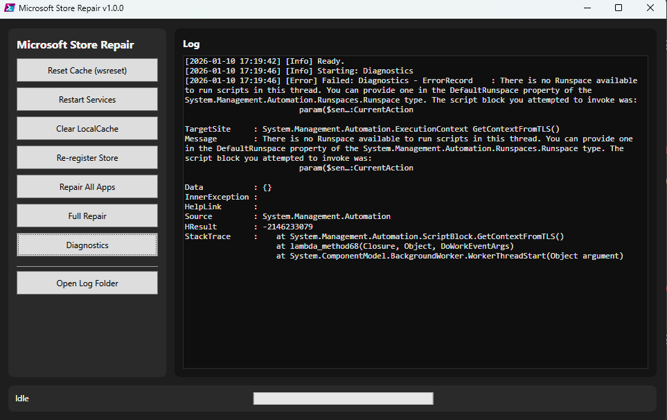

# Microsoft Store Repair (WPF) v1.0.1

[](https://github.com/gmy77/msstore-repair-wpf/releases/latest)

PowerShell tool with a WPF GUI to repair Microsoft Store update/download issues.

## Features
- Reset Store cache (wsreset)
- Restart Store-related services
- Clear Store LocalCache
- Re-register Microsoft Store
- Re-register all UWP apps
- Diagnostics and logging
- Full repair workflow

## Screenshot


## Requirements
- Windows 11
- PowerShell 5.1+ (or PowerShell 7)
- Run as Administrator

## Usage
Open PowerShell as Administrator and run:

```powershell
Set-ExecutionPolicy -Scope Process -ExecutionPolicy Bypass
.\MSStoreRepair.ps1
```

Logs are written to `logs\msstore-repair.log`.

## Download
Grab the latest ZIP from the GitHub Releases page:
https://github.com/gmy77/msstore-repair-wpf/releases
